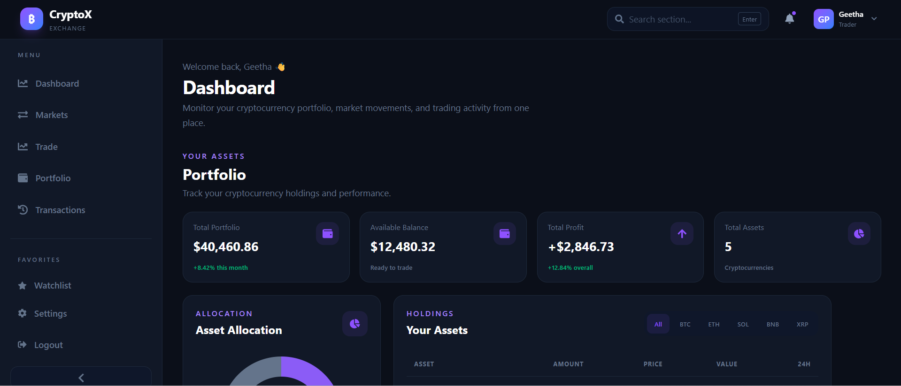
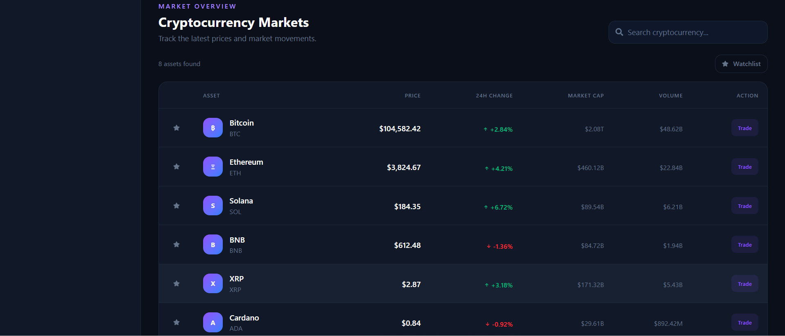
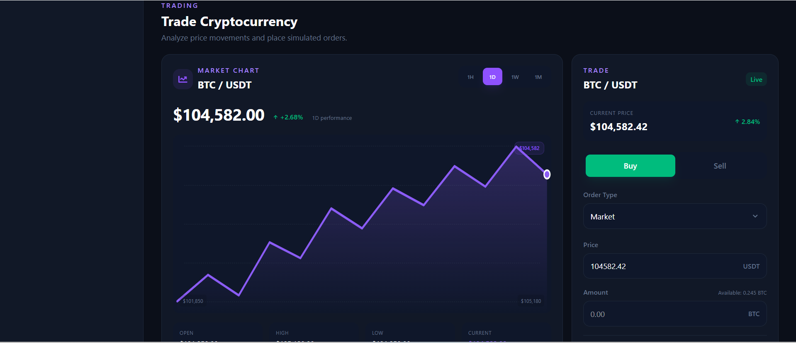
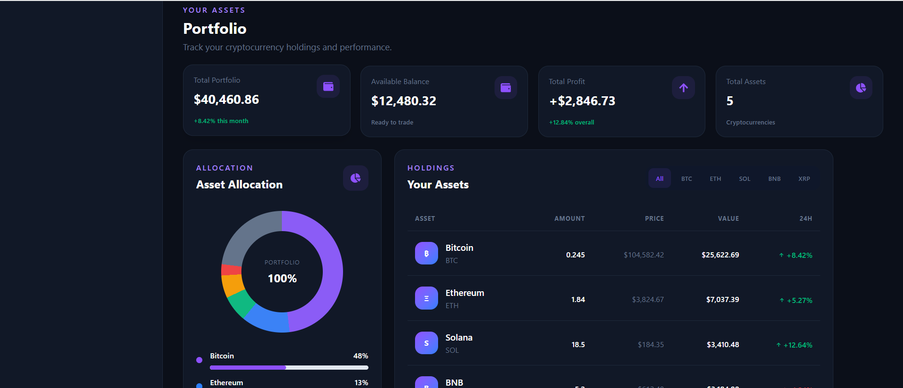
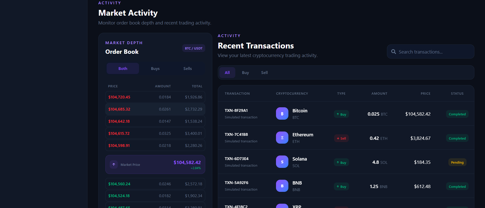

# CryptoX - Cryptocurrency Exchange Dashboard

A modern, responsive Cryptocurrency Exchange Dashboard UI built using React, Vite, and Tailwind CSS.

CryptoX provides a professional cryptocurrency trading interface with market information, trading controls, price charts, order book data, portfolio management, recent transactions, notifications, and responsive navigation.

> This is a frontend training project using mock/static cryptocurrency data. No real cryptocurrency transactions or payments are processed.

## Technologies Used

- React.js
- Vite
- Tailwind CSS
- JavaScript (ES6+)
- React Icons
- HTML5
- CSS3
- Git & GitHub

## Features

- Modern cryptocurrency exchange dashboard
- Responsive design for mobile, tablet, laptop, and desktop
- Dashboard overview
- Cryptocurrency market overview
- Bitcoin, Ethereum, Solana, BNB, and XRP data
- Cryptocurrency search
- Buy/Sell trading interface
- Order type selection
- Amount and price input
- Total calculation
- Price chart with time-period options
- Order book with buy and sell orders
- Recent transactions
- Portfolio balance and holdings
- Profit/Loss indicators
- Asset allocation
- Watchlist
- Notifications
- User profile
- Settings
- Dark/Light theme
- Responsive mobile navigation
- Smooth scrolling
- Hover and active states
- Mock/static cryptocurrency data

## Project Sections

### Dashboard
Displays portfolio summary, balance, available balance, and profit/loss information.

### Market Overview
Displays cryptocurrency name, symbol, current price, 24h change, market cap, and trading volume.

### Trading Section
Includes BTC/USDT trading, Buy/Sell tabs, amount and price inputs, order type selection, and trading buttons.

### Price Chart
Displays cryptocurrency price movements with different time-period options.

### Order Book
Displays buy orders, sell orders, price, amount, total, and current market price.

### Recent Transactions
Displays transaction ID, cryptocurrency, type, amount, price, status, and date/time.

### Portfolio
Displays total balance, available balance, profit/loss, asset allocation, and cryptocurrency holdings.

## Screenshots

### Dashboard



### Market Overview



### Trading Section



### Portfolio



### Recent Transactions



## Installation

### 1. Clone the repository

```bash
git clone https://github.com/Geetha20037/crypto-exchange.git
